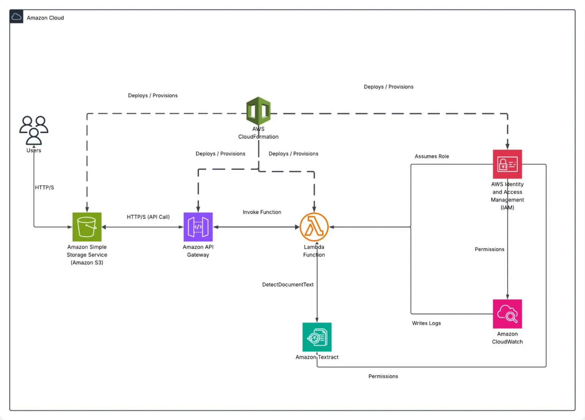

## OCR Web Application ( Serverless Architecture )

This solution provides a lightweight and serverless web application that allows users to upload image files via a browser, process them with Amazon Textract, and return the extracted text — all without storing images in S3 or using any authentication.

> _Try the OCR app [here](https://ocr-light-website.s3.amazonaws.com/index.html)_

<BR>

## Table of Contents
- [OCR Web Application ( Serverless Architecture )](#ocr-web-application--serverless-architecture-)
- [Table of Contents](#table-of-contents)
- [Overview](#overview)
- [Solution Architecture](#solution-architecture)
- [Deployment](#deployment)

<BR>

## Overview

This project is a serverless Optical Character Recognition (OCR) web app built entirely on AWS services. It enables users to extract text from image files in their browser and view the results instantly. It uses Amazon Textract to extract printed text from PNG, JPEG, and TIFF files.

> Images are sent directly to the API via a Base64-encoded payload — no storage or bucket interaction occurs for uploaded content.

<BR>

## Solution Architecture



- __Components__
- **Amazon S3** ➭ Hosts the static frontend (HTML, CSS, JS)
- **API Gateway** ➭ Exposes a REST API to receive image input
- **AWS Lambda** ➭ Decodes base64 images and invokes Amazon Textract
- **Amazon Textract** ➭ Performs OCR on input image
- **IAM Roles** ➭ Grant least-privilege access to services

<BR>

## Deployment

- __Launched the backend stack__

```bash
aws cloudformation deploy \
  --template-file cloudformation/template.yaml \
  --stack-name ocr-backend-stack \
  --capabilities CAPABILITY_NAMED_IAM
```

- This creates
  - Lambda function with Amazon Textract access
  - REST API via API Gateway with access to invoke lambda
  - IAM roles and permissions

<RB>
<BR>
  
- __Deployed the frontend__

```bash
aws s3 sync website/ s3://ocr-light-website --delete
```

- The bucket should has
  - Static website hosting enabled
  - Public read access or appropriate CloudFront/CORS configuration

